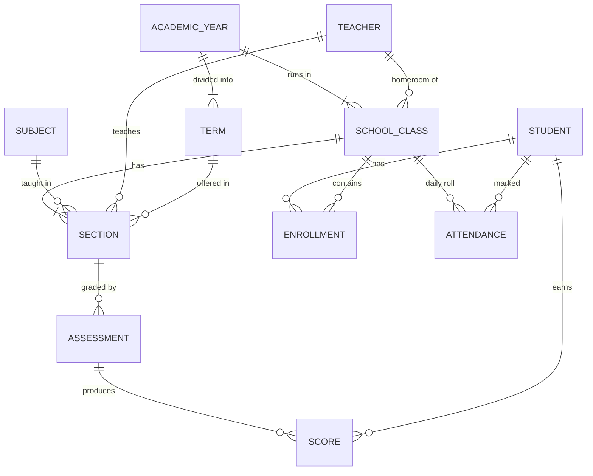

# School

A lightweight school management system for a single small-to-medium school. Built
with Django. This document is the project plan (M0) — it records the decisions
we made and the order we're building in. Keep it current as we go.

## Who it's for

- **School administrator / office staff** — enrolls students, manages classes and
  subjects, pulls reports.
- **Teachers** — take attendance and enter grades for their own classes.

Design bias: optimize for the two highest-frequency tasks — **daily attendance**
and **grade entry**. Everything else is back-office work the Django admin covers.

## Principles

- **Boring tech, always runnable.** Every commit leaves a working app.
- **Vertical slices.** One feature end-to-end beats five half-features.
- **Admin-first.** Django admin for back-office CRUD; custom views only where the
  admin UX is too slow (attendance sheet, gradebook).
- **Real data care.** Server-side validation, Postgres in prod, nightly backups,
  audit trail once we have writes worth auditing.

## Stack & key decisions

| Decision | Choice | Why |
|---|---|---|
| Framework | Django 5.2 LTS | Auth, ORM, migrations, admin — the domain is 70% data CRUD |
| Language | Python 3.11+ | Matches Django; easy to hire/learn |
| Database | SQLite (dev) → Postgres (prod) via `DATABASE_URL` | Zero-setup dev, real DB in prod |
| UI | Server-rendered Django templates; HTMX only if a screen demands it | No JS build chain to babysit |
| PDFs | reportlab | Real PDF downloads, pip-only, no system libraries |
| Auth | Django auth + Groups (`Admin`, `Teacher`) | Built-in, role checks via permissions |
| Tests | pytest-django + factory_boy | Fast, readable |
| Lint/format | ruff | One tool, fast |
| Deploy | Single VPS (gunicorn + nginx) or PaaS; nightly `pg_dump` backups | A school has no DevOps team |

## Domain model (sketch)



- **Student** — name, DOB, guardian contact, admission date, status (active/left/graduated).
- **Teacher** — linked 1:1 to a Django user; subject specialties.
- **AcademicYear / Term** — e.g. 2026/27 divided into **3 terms** (confirmed with the school).
- **SchoolClass** — the homeroom group ("Grade 7B") within an academic year.
- **Subject** — Math, English, … with a code.
- **Section** — a subject taught to a class by a teacher in a term. Enrolling a
  student in a class auto-places them in that class's sections — no per-subject
  enrollment busywork for small schools.
- **Enrollment** — student ↔ class for a year (the student moves class each year).
- **Attendance** — one row per student per day with status
  (present / absent / late / excused). Taken **once each morning by the
  homeroom ("main") teacher**, per class — subject teachers don't take roll.
- **Assessment / Score** — named graded items per section ("Quiz 1", "Midterm",
  weight + max score), with one score per student, **scored out of 100 per
  subject**. The school's term-certification formula is its own system (to be
  shared later), so term aggregation lives behind a single grading-policy seam
  we can slot their formula into without touching the gradebook. Interim
  default: weighted average by assessment weight.

## Roles

| Role | Can do |
|---|---|
| Admin (office) | Everything, mostly via Django admin |
| Teacher | Grades for their own sections, via custom views |
| Homeroom ("main") teacher | The above, **plus** morning attendance for their class |

Students/parents get **no logins** in v1 — a read-only portal is a stretch goal,
not a foundation.

## Milestones

- **M1 — Students & staff slice.** ✅ Student + Teacher models, Django admin,
  idempotent CSV import (`import_students`, with `--dry-run`), pytest suite.
- **M2 — Academic structure.** ✅ Years (auto-creating 3 terms), classes
  ("Grade 7B" = grade level + letter, scoped to a year), subject catalog,
  sections, enrollment. Section membership is *derived* from class enrollment —
  no roster table — so enrolling or transferring a student places them in the
  right sections automatically. Setup busywork removed by a bulk
  **"generate sections (all subjects × terms)"** admin action per class, with
  teacher assignment any time after. Enforced in the DB: one current year, one
  homeroom per teacher per year, unique class/subject/term offerings.
- **M3 — Attendance & gradebook.** ✅ Homeroom teacher's morning roll sheet
  (opens on today, everyone defaults to *present*, mark exceptions only, one
  save — past days editable within the year), per-section gradebook:
  assessments with weight + max score, one-screen score entry per assessment,
  interim weighted averages normalized to 100, and a per-student report
  (subject × term averages + year attendance summary). Access rules enforced
  and tested: homeroom teacher for roll, assigned teacher for gradebook,
  office staff everywhere.
- **M4 — Reports & hardening.** ✅ Term report cards as real PDFs (per student,
  or one batch file per class) with a printed *interim average* disclaimer
  until the certification formula lands; office dashboard on the home page
  (today's roll gaps, sections without grades, per-class PDF links);
  `docs/deployment.md` (Postgres + gunicorn + nginx + HTTPS) and
  `scripts/backup.sh` (nightly `pg_dump`, 30-day retention); permission audit
  covered by the test suite (84 tests).
- **Stretch (post-v1).** Parent/student read-only portal, Amharic localization,
  SMS/email notifications, per-period attendance.

## Working agreements

- Migrations with every model change; tests for all business logic.
- Small commits, one slice at a time, main branch always green.
- When we change a decision recorded here, we update this file in the same commit.

## Working defaults adopted

Answered by the school: **3 terms** per year · **100-point** scale per subject,
with a school-specific **term-certification formula to be shared later** (kept
behind a grading-policy seam) · **daily morning attendance** taken by the
homeroom ("main") teacher.

Defaults for the rest, chosen as sensible and reversible: **English-only UI** at
launch (templates kept translation-ready so Amharic can be layered on) ·
report cards ship as **PDF downloads** (per student + per-class batch) · scale
assumed at a few hundred students / dozens of teachers.

## Getting started

```bash
python3 -m venv .venv && source .venv/bin/activate
pip install -r requirements-dev.txt

python manage.py migrate
python manage.py createsuperuser
python manage.py runserver        # admin at /admin/, teacher UI at /
                                  # (log in at /accounts/login/)

pytest                            # run the test suite
ruff check .                      # lint

# Load students from CSV (dry-run first, then for real):
python manage.py import_students data/sample_students.csv --dry-run
python manage.py import_students data/sample_students.csv
```

Dev uses SQLite automatically; set `DATABASE_URL` for Postgres in production.
Going live: `docs/deployment.md` (server, HTTPS, nightly backups via
`scripts/backup.sh`, and the office's first-run checklist).
