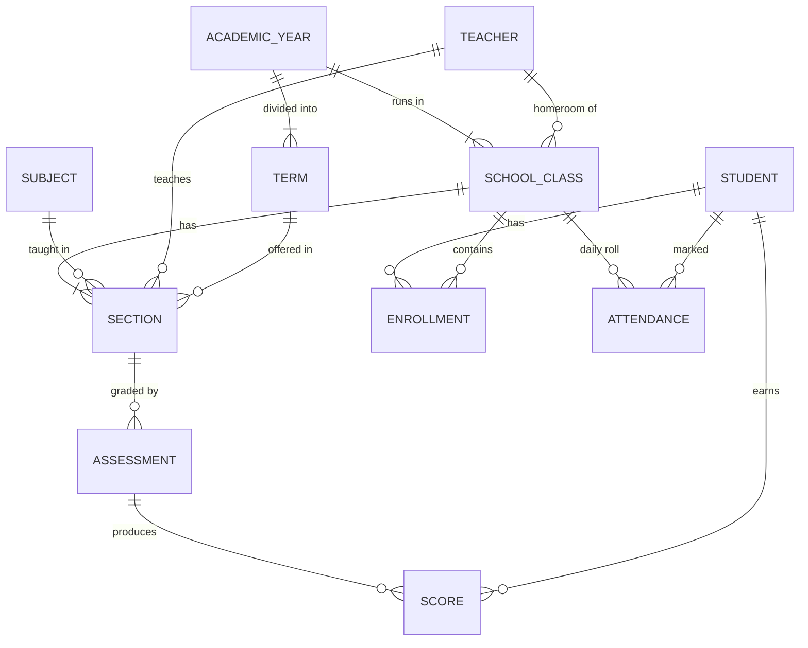

# School

A lightweight school management system for a single small-to-medium school. Built
with Django. This document is the project plan (M0) — it records the decisions
we made and the order we're building in. Keep it current as we go.

## Who it's for

- **School administrator / office staff** — enrolls students, manages classes and
  subjects, pulls reports.
- **Teachers** — take attendance and enter grades for their own classes.

Design bias: optimize for the two highest-frequency tasks — **daily attendance**
and **grade entry**. Everything else is back-office work the Django admin covers.

## Principles

- **Boring tech, always runnable.** Every commit leaves a working app.
- **Vertical slices.** One feature end-to-end beats five half-features.
- **Admin-first.** Django admin for back-office CRUD; custom views only where the
  admin UX is too slow (attendance sheet, gradebook).
- **Real data care.** Server-side validation, Postgres in prod, nightly backups,
  audit trail once we have writes worth auditing.

## Stack & key decisions

| Decision | Choice | Why |
|---|---|---|
| Framework | Django 5.2 LTS | Auth, ORM, migrations, admin — the domain is 70% data CRUD |
| Language | Python 3.12+ | Matches Django; easy to hire/learn |
| Database | SQLite (dev) → Postgres (prod) via `DATABASE_URL` | Zero-setup dev, real DB in prod |
| UI | Server-rendered Django templates; HTMX only if a screen demands it | No JS build chain to babysit |
| Auth | Django auth + Groups (`Admin`, `Teacher`) | Built-in, role checks via permissions |
| Tests | pytest-django + factory_boy | Fast, readable |
| Lint/format | ruff | One tool, fast |
| Deploy | Single VPS (gunicorn + nginx) or PaaS; nightly `pg_dump` backups | A school has no DevOps team |

## Domain model (sketch)

- **Student** — name, DOB, guardian contact, admission date, status (active/left/graduated).
- **Teacher** — linked 1:1 to a Django user; subject specialties.
- **AcademicYear / Term** — e.g. 2026/27 with semesters or quarters (see open questions).
- **SchoolClass** — the homeroom group ("Grade 7B") within an academic year.
- **Subject** — Math, English, … with a code.
- **Section** — a subject taught to a class by a teacher in a term. Enrolling a
  student in a class auto-places them in that class's sections — no per-subject
  enrollment busywork for small schools.
- **Enrollment** — student ↔ class for a year (the student moves class each year).
- **Attendance** — one row per student per day with status
  (present / absent / late / excused), taken per class.
- **Assessment / Score** — named graded items per section ("Quiz 1", "Midterm",
  weight + max score), with one score per student.

## Roles

| Role | Can do |
|---|---|
| Admin (office) | Everything, mostly via Django admin |
| Teacher | Attendance + grades for *their own* class/sections, via custom views |

Students/parents get **no logins** in v1 — a read-only portal is a stretch goal,
not a foundation.

## Milestones

- **M1 — Students & staff slice.** Student + Teacher models, admin setup, CSV
  import for initial student list, tests. *Done when:* office can add/edit/find
  students and teachers can log in.
- **M2 — Academic structure.** Years, terms, classes, subjects, sections,
  enrollment. *Done when:* enrolling a student in a class auto-places them in the
  right sections.
- **M3 — Attendance & gradebook.** Teacher's daily attendance sheet (one tap per
  student), assessment + score entry, per-student term averages. *Done when:* a
  teacher takes roll in under a minute and we can show a student's term report.
- **M4 — Reports & hardening.** Term report card (PDF), admin dashboard,
  backups, deployment guide, role-permission audit.
- **Stretch (post-v1).** Parent/student read-only portal, Amharic localization,
  SMS/email notifications, per-period attendance.

## Working agreements

- Migrations with every model change; tests for all business logic.
- Small commits, one slice at a time, main branch always green.
- When we change a decision recorded here, we update this file in the same commit.

## Open questions (need the school's answers)

1. **Terms** — semesters, quarters, or trimesters?
2. **Grading** — 100-point scale with letter bands? Any school-specific policy?
3. **Attendance** — once daily per class, or per subject period? (Plan assumes daily.)
4. **Language** — English-only UI at launch, or Amharic needed from day one?
5. **Report cards** — is a printable PDF term report a requirement for v1?
6. **Scale** — roughly how many students and teachers? (Informs nothing major, but
   good to know for import + report design.)
